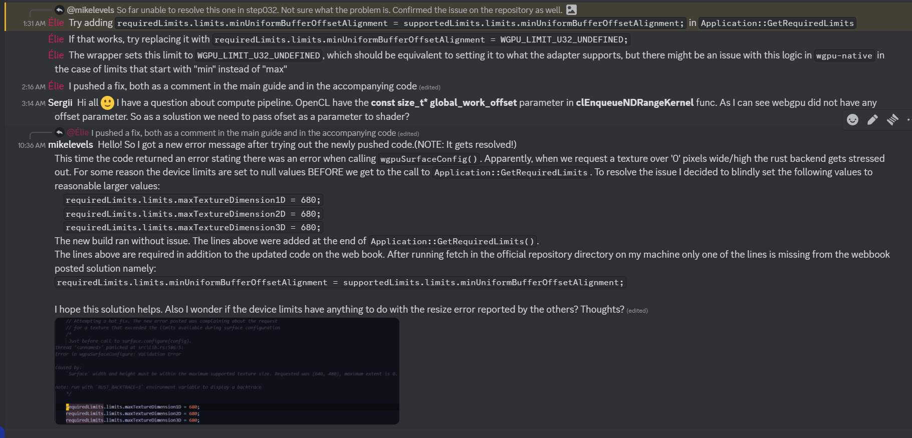

Step000

IMPORTANT:
FIRST - run in an x64 command prompt. Hit the windows key on your keyboard, type in "x64" it should be the first CMD option that appears.
SECOND - confirm that emsdk is running/enabled in the "x64" cmd from before.
    1) Run "emcc --check"
        1) Should get an message saying that it ran sanity checks, then nothing returns.
    2) If that doesnt work navigate to the emsdk directory and confirm that emsdk is setup properly in your current "x64" window to get a meaningful output.
THIRD - Continue with tutorial. At this point(06/23/2024) in time you were here: https://eliemichel.github.io/LearnWebGPU/getting-started/project-setup.html#lit-3

Step001

https://github.com/eliemichel/LearnWebGPU-Code/blob/step001/webgpu/README.md

# Build using wgpu-native backend
cmake -B build-wgpu -DWEBGPU_BACKEND=WGPU
cmake --build build-wgpu

# Build using Dawn backend
cmake -B build-dawn -DWEBGPU_BACKEND=DAWN
cmake --build build-dawn

# Build using emscripten
emcmake cmake -B build-emscripten
cmake --build build-emscripten

Step005

The lines to build the code from Step001 are the same. HOWEVER, in order to RUN
the .wasm output by the emscripten build steps you first need to start a web
server, THEN it will launch the app/wasm in the Chrome/default web browser.

emrun .\path\to\App.html

Most likely:

emrun .\build-emscripten\App.html

In order to exit the webserver Ctr-C then respond Y at the prompt.

DO NOT FORGET TO CONFIRM THE EMSCRIPTEN BUILD STEPS ARE CORRECT IN CMAKELISTS.TXT

The other lines to 'run' the apps you are making for the other build systems are:

.\build-{buildname}\Debug\App.exe

.\build-dawn\Debug\App.exe
.\build-wgpu\Debug\App.exe

FOR SOME REASON THE STATIC WEBGPU BUILD FAILS
ADDITIONALLY EMSCRIPTEN BUILD DOES NOT RETURN DEVICE LIMITS IN BROWSER BUT
EVERYTHING ELSE WAS FINE. FOUND SOMETHING YOU MAY NEED TO USE INSTEAD CALLED
NAVIGATORGPU WHEN USING EMSCRIPTEN.

Step010

CONFIRMED All builds except wgpu-static appeared to work without issue. emscripten
did return the device limits AFTER the device structure was in memory. Not printed
during the adapter stage of initialization.

Step020

CONFIRMED All builds except wgpu-static appeared to work without issue. The only
difference was that emscripten returned a black window, not a white one. It was a
window of the correct size though! So this serves as an indication that it worked
out. Not really interested in a static build if all the other builds are working.

IMPORTANT: All of the code in the "-next" branches are actually older than the non
-suffixed branches. You need to rewrite your code to correspond with the most up to
date branches.

REWRITING EVERYTHING NOW TO REFLECT MOST RECENT BRANCHES.

Step 025

The differences in color are due to dawn and emscripten in Chrome(also just dawn)
operating in different colorspaces than wgpu-native.

After correcting all of your code to reflect the non-next suffix branches the only
other major change was the #ifndef __EMSCRIPTEN__ #endif block!!! Without this key
section the code throws an exception in the Chrome(dawn implementation) browser.

The solution was in the webbook. Michel updated the code with a commit with the 
appropriate change to resolve the issue.

NOTE the critical block is in Application::MainLoop() around line 170-ish.

Step028

CRITICAL:
Intellisense does not reflect the expected behavior of the build output and or the
code generated during the build process.

Carefully confirm the spelling of everything. Intellisense cannot be relied on for
the remainder of the project.

Step030_cpp

ADDED: Suffix "_cpp" to commits/branch note blocks. There are alternative brnaches
available with suffix "-vanilla". These alternative branches refer to the raw C API
implementation of the WGPU interface. 

Any additonal notes in this commit follow:

ALL NECESSARY BUILDS RUN AS EXPECTED.

Step031_cpp

So far everything was fine until you found some minor differences between your code
and Michel's code. Until you encountered `Default`. Turns out it was most likely
something living in wgpu::. But it wasnt appearing at all before?

Maybe you need to clean all builds before building again? Could this lead to issues
with name resolution? There is a problem with name resolution in VSCode 
intellisense, but it couldnt find a common wrapper end point in a namespace?

The issue is resolved. You are not certain if it happened due to you manually 
cleaning it up right now. The following ran without an issue:
    wgpu
    Dawn
    emscripten

The only build that does not work is wgpu-static.

NOTE: After cleaning the builds you had a hard time rebuilding Dawn. This was most
likely due to your slow internet connection. It was only resolved after cleaning 
Dawn and rebuilding it as you usually do one more time!

Step032_cpp

Okay, so there were a few issues that occurred during initialization of the 
Application object. 
    

Step033_cpp

Notably, the program up to this point is running. Several issues were resolved by the tutorial writer to resolve the bugs caused in the build system backend. This time it wasnt you!

Moving forward the new updates to this code will be moved into BRANCHES instead of commits. This more closely follows how the tutorial works.

Step034_cpp

All necessary builds are operational at this point!

Step037_cpp

There are a few items that are not correct in the tutorial here. The code for the Gamma correction is outright missing.

Your .WASM emcc build is not working at this point.

Emmanuel finally convinced you to upload your code to github. It is loaded there now and you need to push your code to the remote repository as well now moving forward.

Step039_cpp

CONFIRMED All three builds run (wgpu, Dawn, emscripten). The emscripten build from Step037 is FIXED.
The cause was NOT your code: Chrome removed the `maxInterStageShaderComponents` limit from the
WebGPU standard and now refuses to create a device when it is set. It is now wrapped in
#ifndef __EMSCRIPTEN__ in GetRequiredLimits().

The Gamma correction from Step037 now actually applies. The exponent comes from a uniform:
2.2 when the surface format is sRGB (wgpu-native, format 24) and 1.0 when it is not (Dawn and
Chrome, format 23). This is the real reason for the color differences noted in Step 025.

IMPORTANT: Visual Studio 2022 had to be REPAIRED with the Visual Studio Installer (cl.exe and
Windows SDK 10.0.26100 were missing). After a repair Dawn rebuilds from scratch, it takes a while.

IMPORTANT: DO NOT update the default emsdk (C:\Users\gonza\Dev\Lib\emsdk, 3.1.63). This project's
webgpu distribution is pinned to emscripten 3.1.61. The latest emscripten lives in a SEPARATE emsdk
(C:\Users\gonza\Dev\Lib\emsdk-latest) and is only used by updatedMyLearnWebGPU.

Step043_cpp

More uniforms. The uniform is now a struct with a vec4f color, the time and the gamma. The vec4f
MUST come first: a vec4f has to start at an offset that is a multiple of 16 bytes. The C++ struct is
padded to 32 bytes and two static_asserts check the layout at compile time. See MyNotes/moreUniforms.md.

CONFIRMED All three builds run (wgpu, Dawn, emscripten). The logo is tinted green on all three.

NOTE: The emscripten build does NOT notice when ONLY a resource changes (shader.wgsl). cmake --build
says "no work to do" and the browser keeps the OLD shader. Touch main.cpp or rebuild until this is fixed.

NOTE: From here on the main guide's chapters are marked as written for an OLDER version of WebGPU.
The code has to be translated to our version. The newer version of each chapter is followed in
updatedMyLearnWebGPU, and the differences are written down there in MyNotes.

Step044_cpp

Dynamic uniforms. The logo is drawn TWICE in one frame. Both uniform blocks live in the SAME buffer,
uniformStride (256) bytes apart, and each draw call picks its block with a dynamic offset in
setBindGroup(). Writing the buffer between two draws does NOT work: draws are only recorded, every
writeBuffer runs before them at submit. See MyNotes/dynamicUniforms.md.

IMPORTANT: First chapter marked as written for an OLDER version of WebGPU. The guide's code uses
requiredFeaturesCount and timestampWriteCount which do not exist in our version. Translate, do not paste.

CONFIRMED All three builds run (wgpu, Dawn, emscripten). Uniform stride is 256 bytes on all three.

Step050_cpp

A simple example. First 3D mesh: resources/pyramid.txt (x y z r g b), loadGeometry got a `dimensions`
argument, the position attribute is Float32x3 and the stride is 6 floats. The vertex shader rotates the
pyramid around X by hand (cos/sin of the time). Dynamic uniforms from Step044 are rolled back like in
the guide (still in commit f446f3e). See MyNotes/aSimpleExample.md.

IMPORTANT: The guide's pyramid.txt ends with a line containing ONE SPACE. Our strict loader said
"Could not load geometry!" on all three builds. The guide's loader silently adds a fake (4, 4, 4)
triangle instead. Blank lines are now detected with find_first_not_of(" \t").

NOTE: The faces overlap in the WRONG order. Expected: no depth buffer yet (next chapter).

CONFIRMED All three builds run (wgpu, Dawn, emscripten).

HERE

