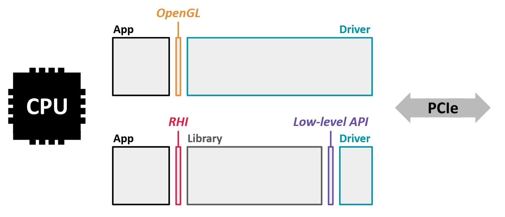

# Hello WebGPU

Code is commit message prefix "step001"

WebGPU is an RHI (render hardware interface), it is a programming library meant to provide a unified interface for multiple underlying graphics hardware and operating system setups.

Your C++ code will have an single header file, it lists all available procedures and data structures: webgpu.h.

Notably, when building the program, the compiler must know in the end(the final linking step) where to find the actual implementation of these functions. Unlike native APIs, WebGPU is not provided by the driver, so we must explicitly provide it.



# Installing WebGPU

As of the time of this writing there are two implementations of the WebGPU native header:

1) wgpu-native, exposing a native interface to the wgpu Rust library developed for Firefox
2) Google's Dawn, developed for Chrome.

What follows in the guide is a best effort attempt to implement both, or one or the other.

I am choosing to use both. And I am setting up the build for web tool chain.

# Testing the installation

The setup described here relies on git and python to run properly. Shallow copies of repositories found online are made and built automatically, or their binaries are pulled to enable building your project for the platforms under consideration.

To tes the implementation we grate a WebGPU instance, check it and destroy it.

# Descriptors and Creation

The instance is created using the function wgpuCreateInstance.

Like all WebGPU functions meant to create an entity, it takes as argument a descriptor, it is used to specify options regarding how to setup this object.

> NOTE:
> The descriptor is a means to pack many function arguments together, some descriptors have a lot of fields. Descriptors can also be used to write utility functions that take care of populating arguments, to ease the program's architecture.

Yet another WebGPU idiom is showcased in WGPUInstanceDescriptor in the code. The first field descriptor field is always a pointer called nextInChain. This is a generic way for the API to enable custom extensions added in the future, or to return multiple entries of data. In many cases it is set to nullptr.

# Checking

WebGPU entities created with a 'wgpuCreateSomething' function is technically just a pointer. A handle to identify the actual object, it lives on the backend side, the backend never needs to be directly accessed.

To check that an object is valid, we can just compare it with nullptr, or use the boolean operator as shown in the code see the if statement that depends on instance:

The code as it stands in this commit should print something that looks like a pointer on CMD.

# Destruction and lifetime management

All things created using WebGPU must eventually be released. Remember anything that creates something looks like 'wgpuCreateSomething'? Similarly, releasing resources looks like 'wgpuReleaseSomething'.

> NOTE: Each object internally holds a reference counter, releasing it only frees related memory if no other part of your code still references it (i.e., when the counter falls to 0):

```Cpp
WGPUSomething sth = wgpuCreateSomething(/* descriptor */);

//This means "increase the reference counter of the object 'sth' by 1"
wgpuSomethingReference(sth);
//Now the reference is 2 (it is set to 1 at creation)

//This means "decrease the ref counter of the object sth by 1, if the ref count reaches 0 then destroy the underlying object
wgpuSomethingRelease(sth);
//At this point of the pseudo-code block the reference is back to 1, the object can still be used

//Release again
wgpuSomethingRelease(sth);
//Now the reference is down to 0, the object is destroyed, no longer usable
```

# Implementation-specific behavior

The following preprocessor directives are provided to handle the differences between implementations. The distributions provided also define the directives located in main.cpp

> IMPORTANT: You spent about 2.5 hours troubleshooting a simple issue were you had not typed the right text into your file! BE VERY CAREFUL ABOUT EACH LINE OF CODE!
