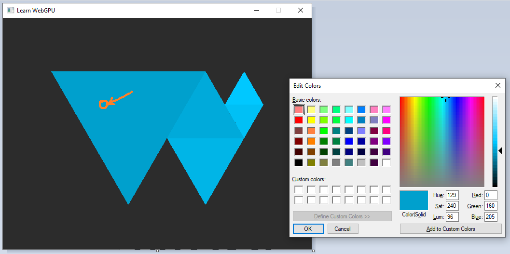

Step037

# Loading from file

>[!important]
> At the time of writing this file the the author was still working on updating the code, and the webbook for this section. 

Now that there is a path for representing geometric data that the GPU expect, move on to loading it from file instead of hard coding it in the source code. This is the occasion to introduce some basic resource management to the project(this is not specific to WebGPU).

## File format

### Example

The file format introduced here is not standard, but it is simple to parse. Here is the content of `webgpu.txt`, which is located in a `resources/` directory:

```Python
[points]
# x   y      r   g   b

0.5   0.0    0.0 0.353 0.612
1.0   0.866  0.0 0.353 0.612
0.0   0.866  0.0 0.353 0.612

0.75  0.433  0.0 0.4   0.7
1.25  0.433  0.0 0.4   0.7
1.0   0.866  0.0 0.4   0.7

1.0   0.0    0.0 0.463 0.8
1.25  0.433  0.0 0.463 0.8
0.75  0.433  0.0 0.463 0.8

1.25  0.433  0.0 0.525 0.91
1.375 0.65   0.0 0.525 0.91
1.125 0.65   0.0 0.525 0.91

1.125 0.65   0.0 0.576 1.0
1.375 0.65   0.0 0.576 1.0
1.25  0.866  0.0 0.576 1.0

[indices]
 0  1  2
 3  4  5
 6  7  8
 9 10 11
12 13 14
```

It is basically the content of `pointData` and `indexData` defined previously as C++ vectors, introduced by a line of the form `[section name]`. Lines that are empty or starting with a `#` are ignored.

>[!note]
> We can already bump up the maximum buffer size limit:
>```Cpp
>requiredLimits.limits.maxBufferSize = 15 * 5 * sizeof(float);
>```

### Parser

Below is a dead simple parser. It should be straight forward to follow. If you need a better parser move on to some other tool chain. This topic is not covered in detail here.

Besides, once we start handling 3D data we will switch to a more standard format anyways.

```Cpp
#include <filesystem>
#include <fstream>
#include <sstream>
#include <string>

namespace fs = std::filesystem;

bool loadGeometry(const fs::path& path, std::vector<float>& pointData, std::vector<uint16_t>& indexData) {
    std::ifstream file(path);
    if (!file.is_open()) {
        return false;
    }

    pointData.clear();
    indexData.clear();

    enum class Section {
        None,
        Points,
        Indices,
    };
    Section currentSection = Section::None;

    float value;
    uint16_t index;
    std::string line;
    while (!file.eof()) {
        getline(file, line);
        
        // overcome the `CRLF` problem
            if (!line.empty() && line.back() == '\r') {
              line.pop_back();
            }
        
        if (line == "[points]") {
            currentSection = Section::Points;
        }
        else if (line == "[indices]") {
            currentSection = Section::Indices;
        }
        else if (line[0] == '#' || line.empty()) {
            // Do nothing, this is a comment
        }
        else if (currentSection == Section::Points) {
            std::istringstream iss(line);
            // Get x, y, r, g, b
            for (int i = 0; i < 5; ++i) {
                iss >> value;
                pointData.push_back(value);
            }
        }
        else if (currentSection == Section::Indices) {
            std::istringstream iss(line);
            // Get corners #0 #1 and #2
            for (int i = 0; i < 3; ++i) {
                iss >> index;
                indexData.push_back(index);
            }
        }
    }
    return true;
}
```

## Loading resources from disc

### Basic approach

We can replace the definition of the `pointData` and `indexData` vectors by a call to our new `loadGeometry` function.

```Cpp
std::vector<float> pointData;
std::vector<uint16_t> indexData;

bool success = loadGeometry("resources/webgpu.txt", pointData, indexData);
if (!success) {
    std::cerr << "Could not load geometry!" << std::endl;
    return 1;
}
```

A problem we have with this hard-coded relative path is that its interpretation depends on the directory form which you run your executable:

```Cpp
my_project> ./build/App
(Working all right)
my_project> cd build
my_project/build> ./App
Could not load geometry!
```

In the second case, your program tries to open `my_project/build/resources/webgpu.txt`, which does not exist. There are a few options to address this:

* Option A Don’t care, just call your program from the right directory. It could be annoying, and the problem is that IDEs usually run the executable from `build/` or even a subdirectory of `build/`.

* Option B Use an absolute path. This will only work on your machine, which is quite of a limitation.

* Option C Use an absolute path that is automatically generated thanks to CMake. This is what we’ll do.

* Option D Use a command line argument to tell the program where to find the resource directory. This is an interesting option, which can be used in combination with Option C, but requires a bit more work.

* Option E Automatically copy the resources in the directory from which your IDE launches the program. This will be a problem once we try to modify resources while the program is running (which is quite handy when writing shaders).

### Resource path resolution

We will do something super simple for now:

```Cpp
#define RESOURCE_DIR "/home/me/src/my_project/resources"
loadGeometry(RESOURCE_DIR "/webgpu.txt", pointData, indexData);
```

Except that the `#define RESOURCE_DIR` will be added by CMake rather than being explicitly written in our source code!

>[!note]
> When putting two string literals next to each others in a C or C++ source code, like in `loadGeometry("resource" "/webgpu.txt", ...)`, they are automatically concatenated. This is precisely meant for our use case to work!

To define `RESOURCE_DIR` in the `CMakeLists.txt` you can add this after creating the `App` target:

```Cpp
target_compile_definitions(App PRIVATE
    RESOURCE_DIR="${CMAKE_CURRENT_SOURCE_DIR}/resources"
)
```

The expression `${CMAKE_CURRENT_SOURCE_DIR}` is replaced by the content of CMake's variable `CMAKE_CURRENT_SOURCE_DIR`, which is a built-in variable containing the full path to the `CMakeLists.txt` file that you are editing.

>[!note]
> When writing a CMake function, the `CMAKE_CURRENT_SOURCE_DIR` variable contains the directory of the `CMakeLists.txt` that is currently calling the function. If you want to refer to the directory of the `CMakeLists.txt` that defines the function, use `CMAKE_CURRENT_LIST_DIR` instead.

### Portability

> 😒 Hey but in the end our executable uses an absolute path, so we have this portability issue when trying to share it, right?

True. However we can easily add an option to globally change the resource directory when building a release that we want to be able to distribute:

```Python
# We add an option to enable different settings when developing the app than
# when distributing it.
option(DEV_MODE "Set up development helper settings" ON)

if(DEV_MODE)
    # In dev mode, we load resources from the source tree, so that when we
    # dynamically edit resources (like shaders), these are correctly
    # versionned.
    target_compile_definitions(App PRIVATE
        RESOURCE_DIR="${CMAKE_CURRENT_SOURCE_DIR}/resources"
    )
else()
    # In release mode, we just load resources relatively to wherever the
    # executable is launched from, so that the binary is portable
    target_compile_definitions(App PRIVATE
        RESOURCE_DIR="./resources"
    )
endif()
```

You can then have 2 different builds of your project in two different directories:

```bash
cmake -B build-dev -DDEV_MODE=ON -DCMAKE_BUILD_TYPE=Debug
cmake -B build-release -DDEV_MODE=OFF -DCMAKE_BUILD_TYPE=Release
```

The first one for comfort of development, the second one for the portability of a release.

>[!tip]
> The `CMAKE_BUILD_TYPE` option is a built-in option of CMake that is very commonly used. Set it to `Debug` to compile your program with *debugging symbols*(see the debugging section), at the expense of a slower and heavier executable. Set it to `Release` to have a fast and lightweight executable with no debugging safe-guard.
>
>When using some CMake generators, like the Visual Studio one, this is ignored because the generated solution can switch from Debug to Release mode directly in the IDE instead of asking CMake.

## Shaders

Now that we have a basic resource path resolution mechanism, I strongly suggest we use to load our shader code, instead of hard-coding it in the C++ source as we have been doing from the beginning. We can even include the whole shader module creation call:

```Cpp
ShaderModule loadShaderModule(const fs::path& path, Device device) {
    std::ifstream file(path);
    if (!file.is_open()) {
        return nullptr;
    }
    file.seekg(0, std::ios::end);
    size_t size = file.tellg();
    std::string shaderSource(size, ' ');
    file.seekg(0);
    file.read(shaderSource.data(), size);

    ShaderModuleWGSLDescriptor shaderCodeDesc{};
    shaderCodeDesc.chain.next = nullptr;
    shaderCodeDesc.chain.sType = SType::ShaderModuleWGSLDescriptor;
    shaderCodeDesc.code = shaderSource.c_str();
    ShaderModuleDescriptor shaderDesc{};
    shaderDesc.hintCount = 0;
    shaderDesc.hints = nullptr;
    shaderDesc.nextInChain = &shaderCodeDesc.chain;
    return device.createShaderModule(shaderDesc);
}
```

Move the original content of the shaderSource variable into `resources/shader.wgsl` and replace the module creation step by:

```Cpp
std::cout << "Creating shader module..." << std::endl;
ShaderModule shaderModule = loadShaderModule(RESOURCE_DIR "/shader.wgsl", device);
std::cout << "Shader module: " << shaderModule << std::endl;
```

This way, you `no longer need to rebuild` the application when you only want to change the shader!

## Adjustments

### Transform

If you run the program you should get something not quite right on the window. It should be a mostly obscured shape. Only some of the blue triangles are visible.

So how do we "move" the object? Similarly to how we fixed the ratio issue in the previous chapter, we can do it in the *vertex shader*, by adding something to the `x` and `y` coordinates:

```rust
let offset = vec2f(-0.6875, -0.463);
out.position = vec4f(in.position.x + offset.x, (in.position.y + offset.y) * ratio, 0.0, 1.0);
```

>[!note]
> It is important to apply the scene transform *before* the viewport transform(the ratio). We will get back on this more in detail when adding the 3D to 2D projection transform needed for drawing 3D meshes!(future section)

### Color issue

You are not just being picky, there is *something wrong* with the colors! Compare to the logo in the left panel, the colors in the window seem lighter, and even have a different tint.

>[!note]
> This behavior depends on your device, so you may actually see correct colors. I recommend you read the following anyways though!

Maybe there was a mistake when writing in the color values? That could explain the issues with the colors?

Not quite. Lets consider the color on the third line of the file, this color is the color of the largest triangle:

```Python
0.0 0.353 0.612
```

These are _red_, _green_ and _blue_ values expressed in the range (0,1) but let's *remap* them to the integer range $[0, 255]$ (8-bit per channel) which is what your screen most likely displays(and hence what usual image file formats store):

```Python
0 90 156
```

Now we can check on a screencapture the color of the big triangle:


_Color picking the big triangle in a screenshoot of our windows shows a color of $(0,160,205)$._

Interesting, the mapped values do not match the values returned by the color picker. Why is that? This is evidence of a *color space* issue, meaning that we are expressing colors in a given space, but they end up being interpreted differently. This may happen in a lot of contexts, so it is quite useful to be aware of the basics(actual color science is a non-trivial matter in general).
