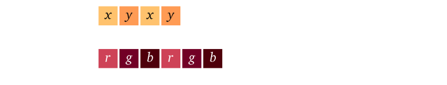

Step033

# Multiple Attributes

Vertices can contain more than just a position attribute. A typical example is to add a color attribute to each vertex. This will also show us how the rasterizer automatically interpolate vertex attributes across triangles.

## Shader

### Vertex input struct

You may have guessed that we can simply add a second argument to the vertex shader entry point `vs_main`, with a different `@location` WGSL attribute:

```Cpp
// We could do this, but there might be a lot of attributes
@vertex
fn vs_main(@location(0) in_position: vec2f, @location(1) in_color: vec3f) -> /* ... */ {
    // [...]
}
```

This works, but when the number of input attribute grows, we will prefer take instead a single argument whose type is a custom struct labeled with locations:

```Cpp
/**
 * A structure with fields labeled with vertex attribute locations can be used
 * as input to the entry point of a shader.
 */
struct VertexInput {
    @location(0) position: vec2f,
    @location(1) color: vec3f,
};
```

Our vertex shader thus only receive one single argument, whose type is `VertexInput`:

```Cpp
fn vs_main(in: VertexInput) -> /* ... */ {
    {{Vertex shader body}}
}
```

```Cpp
const char* shaderSource = R"(
{{Shader prelude}}

@vertex
{{Vertex shader}}

@fragment
{{Fragment shader}}
)";
```

```Cpp
{{Define VertexInput struct}}
```

### Forwarding vertex attribute to fragments

You might be asking yourself right now, if I want the color in the fragment shader why not simply do, `fs_main(@location(1) color: vec3f)?`

No can do! The vertex attributes are only provided to the vertex shader. However, the fragment shader can receive whatever the vertex shader returns! This is why we are planning to use the structure based approach.

Change the signature of `vs_main` to return a custom struct (instead of `@builtin(position) vec4f`):

```Cpp
fn vs_main(in: VertexInput) -> VertexOutput {
    //                         ^^^^^^^^^^^^ We return a custom struct
    {{Vertex shader body}}
}
```

Then we need to define this struct. We of course need the mandatory `@builtin(position)` attribute required by the rasterizer to know where on screen to draw the geometry. We also add a custom vertex shader output, which we name `color` and associate to location 0.

```Cpp
/**
 * A structure with fields labeled with builtins and locations can also be used
 * as *output* of the vertex shader, which is also the input of the fragment
 * shader.
 */
struct VertexOutput {
    @builtin(position) position: vec4f,
    // The location here does not refer to a vertex attribute, it just means
    // that this field must be handled by the rasterizer.
    // (It can also refer to another field of another struct that would be used
    // as input to the fragment shader.)
    @location(0) color: vec3f,
};
```

```Cpp
{{Define VertexOutput struct}}
```

Now we can change the arguments of the fragment shader entry point `fs_main`. Like for the vertex shader, we can directly label arguments:

```Cpp
// We can directly label arguments:
fn fs_main(@location(0) color: vec3f) -> @location(0) vec4f {
    //     ^^^^^^^^^^^^^^^^^^^^^^^^^ A new argument, with a location WGSL attribute
    {{Fragment shader body}}
}
```

Or we can use a custom struct whose fields are labeled... like the `VertexOutput` itself. It could be a different one, as long as we stay consistent regarding `@location` indices.

```Cpp
// Or we can use a custom struct whose fields are labeled
fn fs_main(in: VertexOutput) -> @location(0) vec4f {
    //     ^^^^^^^^^^^^^^^^ Use for instance the same struct as what the vertex outputs
    {{Fragment shader body}}
}
```

All there remains now is to connect the dots and return them from the vertex shader the color needed by the fragment shader:

```Cpp
@vertex
fn vs_main(in: VertexInput) -> VertexOutput {
    var out: VertexOutput; // create the output struct
    out.position = vec4f(in.position, 0.0, 1.0); // same as what we used to directly return
    out.color = in.color; // forward the color attribute to the fragment shader
    return out;
}

@fragment
fn fs_main(in: VertexOutput) -> @location(0) vec4f {
    return vec4f(in.color, 1.0); // use the interpolated color coming from the vertex shader
}
```
```Cpp
// In vs_main()
var out: VertexOutput; // create the output struct
out.position = vec4f(in.position, 0.0, 1.0); // same as what we used to directly return
out.color = in.color; // forward the color attribute to the fragment shader
return out;
```
```Cpp
// In fs_main()
return vec4f(in.color, 1.0); // use the interpolated color coming from the vertex shader
```

#### Capabilities

There is a limit on the number of components that can be forwarded from vertex to fragment shader. In our case, we ask for three float components:

```Cpp
// There is a maximum of 3 float forwarded from vertex to fragment shader
requiredLimits.limits.maxInterStageShaderComponents = 3;
```

## Vertex Buffer Layout

We defined in the previous section how to handle a new color attribute in the shaders, but so far we did not feed any new data for this attribute.

There are different ways of feeding multiple attributes to the vertex fetch stage. The choice usually depends on the way your input data is organized, which varies with the context, so there are two different ways presented below.

> Device Limits
> Before anything, do not forget to increase the vertex attribute limit of your device:
>```Cpp
>requiredLimits.limits.maxVertexAttributes = 2;
>//                                          ^ This was 1
>```

### Option A: Interleaved Attributes


#### Vertex Data

Interleaved attributes means that we put in a single buffer the values for all the attributes of the first vertex, then all values for the second vertex, etc:

```Cpp
std::vector<float> vertexData = {
    // x0,  y0,  r0,  g0,  b0
    -0.5, -0.5, 1.0, 0.0, 0.0,

    // x1,  y1,  r1,  g1,  b1
    +0.5, -0.5, 0.0, 1.0, 0.0,

    // ...
    +0.0,   +0.5, 0.0, 0.0, 1.0,
    -0.55f, -0.5, 1.0, 1.0, 0.0,
    -0.05f, +0.5, 1.0, 0.0, 1.0,
    -0.55f, +0.5, 0.0, 1.0, 1.0
};

// We now divide the vector size by 5 fields.
vertexCount = static_cast<uint32_t>(vertexData.size() / 5);
```

#### Layout and Attributes

Still one buffer, but with 2 elements in the `vertexBufferLayout.attributes` array. So instead of passing the address `&positionAttrib` of a single entry, we use a `std::vector`:

```Cpp
// We now have 2 attributes
std::vector<VertexAttribute> vertexAttribs(2);

{{Describe the position attribute}}
{{Describe the color attribute}}

vertexBufferLayout.attributeCount = static_cast<uint32_t>(vertexAttribs.size());
vertexBufferLayout.attributes = vertexAttribs.data();

{{Describe buffer stride and step mode}}
```

The first thing we can remark is that now the byte stride of our position (x,y) has changed from `2*sizeof(float)` to `5*sizeof(float)`:

```Cpp
vertexBufferLayout.arrayStride = 5 * sizeof(float);
//                               ^^^^^^^^^^^^^^^^^ The new stride
vertexBufferLayout.stepMode = VertexStepMode::Vertex;
```

>Device Limits
>We thus need to update the buffer size and stride limits:
>```Cpp
>requiredLimits.limits.maxBufferSize = 6 * 5 * sizeof(float);
>requiredLimits.limits.maxVertexBufferArrayStride = 5 * sizeof(float);
>```

This stride is the same for both attributes, because jumping from $x_1$ to $x_2$ is the same distance as jumping from $r_1$ to $r_2$. So it is not a problem that the stride is set at the level of the whole buffer layout.

The main difference between our two attributes actually is the byte offset at which they start in the buffer. The position still starts at the beginning of the buffer, i.e., at offset 0:

```Cpp
// Describe the position attribute
vertexAttribs[0].shaderLocation = 0; // @location(0)
vertexAttribs[0].format = VertexFormat::Float32x2;
vertexAttribs[0].offset = 0;
```

### Option B: Multiple Buffers



Another possible data layout is to have two different buffers for the two attributes.

> Device Limits
> Make sure to change the device limit to support this:
>```Cpp
>requiredLimits.limits.maxVertexBuffers = 2;
>```

#### Vertex Data

We thus have 2 input vectors:

```Cpp
// x0, y0, x1, y1, ...
std::vector<float> positionData = {
    -0.5, -0.5,
    +0.5, -0.5,
    +0.0, +0.5,
    -0.55f, -0.5,
    -0.05f, +0.5,
    -0.55f, +0.5
};

// r0,  g0,  b0, r1,  g1,  b1, ...
std::vector<float> colorData = {
    1.0, 0.0, 0.0,
    0.0, 1.0, 0.0,
    0.0, 0.0, 1.0,
    1.0, 1.0, 0.0,
    1.0, 0.0, 1.0,
    0.0, 1.0, 1.0
};

vertexCount = static_cast<uint32_t>(positionData.size() / 2);
assert(vertexCount == static_cast<uint32_t>(colorData.size() / 3));
```

> Note
> This time, the maximum buffer size/stride can be lower:
>```Cpp
>requiredLimits.limits.maxBufferSize = 6 * 3 * sizeof(float);
>requiredLimits.limits.maxVertexBufferArrayStride = 3 * sizeof(float);
>```

#### Buffers

This leads to creating two GPU buffers `positionBuffer` and `colorBuffer`:

```Cpp
// Create vertex buffers
BufferDescriptor bufferDesc;
bufferDesc.usage = BufferUsage::CopyDst | BufferUsage::Vertex;
bufferDesc.mappedAtCreation = false;

bufferDesc.label = "Vertex Position";
bufferDesc.size = positionData.size() * sizeof(float);
positionBuffer = device.createBuffer(bufferDesc);
queue.writeBuffer(positionBuffer, 0, positionData.data(), bufferDesc.size);

bufferDesc.label = "Vertex Color";
bufferDesc.size = colorData.size() * sizeof(float);
colorBuffer = device.createBuffer(bufferDesc);
queue.writeBuffer(colorBuffer, 0, colorData.data(), bufferDesc.size);
```

```Cpp
// It is not easy with the auto-generation of code to remove the previously
// defined `vertexBuffer` attribute, but at the same time some compilers
// (rightfully) complain if we do not use it. This is a hack to mark the
// variable as used and have automated build tests pass.
(void)vertexBuffer;
```

We declare `positionBuffer` and `colorBuffer` as members of the `Application` class so that we can access them in `MainLoop()`:

```Cpp
private: // Application attributes
    Buffer positionBuffer;
    Buffer colorBuffer;
```

And don't forget to release them in `Terminate()`:

```Cpp
// At the beginning of Terminate()
positionBuffer.release();
colorBuffer.release();
```

#### Layout and Attributes

This time it not the `VertexAttribute` struct but the `VertexBufferLayout` that is replaced with a vector:

```Cpp
// We now have 2 attributes
std::vector<VertexBufferLayout> vertexBufferLayouts(2);

// Position attribute
{{Describe the position attribute and buffer layout}}

// Color attribute
{{Describe the color attribute and buffer layout}}

pipelineDesc.vertex.bufferCount = static_cast<uint32_t>(vertexBufferLayouts.size());
pipelineDesc.vertex.buffers = vertexBufferLayouts.data();
```

The position attributr itself remains as it was in the previous chapter when it was the only attribute:

```Cpp
// Position attribute remains untouched
VertexAttribute positionAttrib;
positionAttrib.shaderLocation = 0; // @location(0)
positionAttrib.format = VertexFormat::Float32x2; // size of position
positionAttrib.offset = 0;

vertexBufferLayouts[0].attributeCount = 1;
vertexBufferLayouts[0].attributes = &positionAttrib;
vertexBufferLayouts[0].arrayStride = 2 * sizeof(float); // stride = size of position
vertexBufferLayouts[0].stepMode = VertexStepMode::Vertex;
```

The new color attribute has this time also a byte offset of 0(in its own buffer), but this time a different byte stride:

```Cpp
// Color attribute
VertexAttribute colorAttrib;
colorAttrib.shaderLocation = 1; // @location(1)
colorAttrib.format = VertexFormat::Float32x3; // size of color
colorAttrib.offset = 0;

vertexBufferLayouts[1].attributeCount = 1;
vertexBufferLayouts[1].attributes = &colorAttrib;
vertexBufferLayouts[1].arrayStride = 3 * sizeof(float); // stride = size of color
vertexBufferLayouts[1].stepMode = VertexStepMode::Vertex;
```

#### Render Pass

And finally in the render pass we have to set both vertex buffers by calling `renderPass.setVertexBuffer` twice. The first argument(`slot`) corresponds to the index of the buffer layout in the `pipelineDesc.vertex.buffers` array.

```Cpp
renderPass.setPipeline(pipeline);

// Set vertex buffers while encoding the render pass
renderPass.setVertexBuffer(0, positionBuffer, 0, positionBuffer.getSize());
renderPass.setVertexBuffer(1, colorBuffer, 0, colorBuffer.getSize());
//                         ^ Add a second call to set the second vertex buffer

// We use the `vertexCount` variable instead of hard-coding the vertex count
renderPass.draw(vertexCount, 1, 0, 0);
```

# Conclusion

> Tip
> Elie changed the background color(`clearValue`) to `Color{0.05, 0.05, 0.05,1.0}` to better appreciate the colors of the triangles.

```Cpp
renderPassColorAttachment.view = targetView;
renderPassColorAttachment.resolveTarget = nullptr;
renderPassColorAttachment.loadOp = LoadOp::Clear;
renderPassColorAttachment.storeOp = StoreOp::Store;
renderPassColorAttachment.clearValue = Color{ 0.05, 0.05, 0.05, 1.0 };
#ifndef WEBGPU_BACKEND_WGPU
renderPassColorAttachment.depthSlice = WGPU_DEPTH_SLICE_UNDEFINED;
#endif // NOT WEBGPU_BACKEND_WGPU
```

```Cpp
renderPassColorAttachment.view = targetView;
renderPassColorAttachment.resolveTarget = nullptr;
renderPassColorAttachment.loadOp = WGPULoadOp_Clear;
renderPassColorAttachment.storeOp = WGPUStoreOp_Store;
renderPassColorAttachment.clearValue = WGPUColor{ 0.05, 0.05, 0.05, 1.0 };
#ifndef WEBGPU_BACKEND_WGPU
renderPassColorAttachment.depthSlice = WGPU_DEPTH_SLICE_UNDEFINED;
#endif // NOT WEBGPU_BACKEND_WGPU
```

Notably, there was lot wrong with the items you added above. It turned out to be unnecessary.

Moving forward you are now back on track with the code running.

So instead of specifying each item that is missing according to the errors produced in returnrequiredlimits, Elie Michel updated the dependencies in the online distributions located here:

https://github.com/eliemichel/WebGPU-distribution/tree/main

Everything runs up to this point now.

Step033
